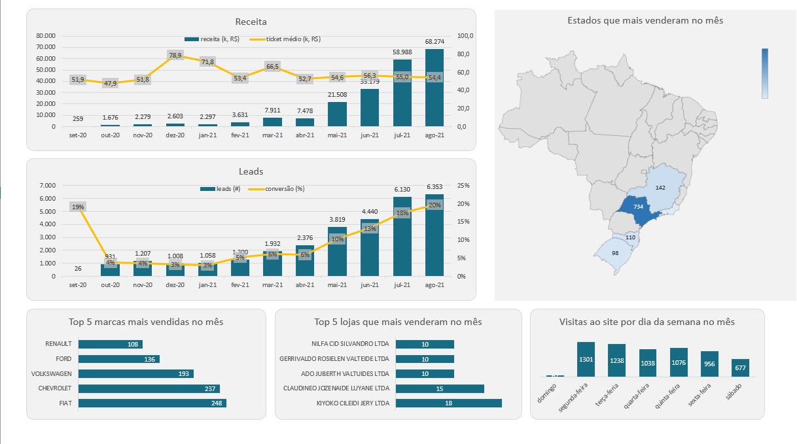

# Sales Funnel SQL Analysis

Sales funnel analysis using SQL with dashboard visualization.

This project analyzes an e-commerce sales funnel to understand sales performance, customer behavior, and business metrics using SQL queries and a dashboard.

---

# Project Overview

The objective of this project is to explore sales funnel data and extract insights about:

- Monthly revenue performance
- Lead generation and conversion rate
- Top selling brands
- Best performing stores
- Geographic distribution of sales
- Website traffic patterns

The analysis was performed using **PostgreSQL** and the results were visualized in a **dashboard built in Excel**.

---

# Technologies Used

- SQL (PostgreSQL)
- Excel Dashboard
- Data analysis techniques
- Sales funnel metrics

---

# Dashboard Preview



---

# Key Business Metrics

The project analyzes the following key metrics:

- Leads
- Sales
- Revenue
- Conversion Rate
- Average Ticket
- Top Performing States
- Top Selling Brands
- Top Performing Stores
- Website Visits by Day of Week

---

# SQL Analysis

The SQL queries used for the analysis are organized in the `SQL` folder:

| File | Description |
|-----|-------------|
| 01_monthly_funnel.sql | Monthly analysis of revenue, leads, conversion rate and average ticket |
| 02_top_states.sql | Top states with highest number of sales |
| 03_top_brands.sql | Top brands by number of sales |
| 04_top_stores.sql | Stores with highest sales volume |
| 05_weekday_visits.sql | Website visits by day of week |

---

## Project Structure

The repository is organized as follows:

```
sales-funnel-sql-analysis
│
├── 📁 Dashboard
│   ├── Projeto1_Dashboard_vendas.xlsx
│   └── dashboard_preview.png
│
└── 📁 SQL
    ├── 01_monthly_funnel.sql
    ├── 02_top_states.sql
    ├── 03_top_brands.sql
    ├── 04_top_stores.sql
    └── 05_weekday_visits.sql
```


---

# Author

Caio Faria Suzuki Costa
